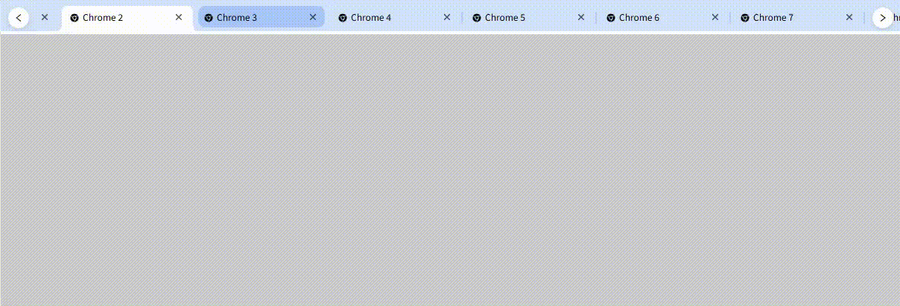

[English](./README.md) | [中文](./README-CH.md) 

# ChromeStyleTabs Component Documentation

## Component Introduction

`ChromeStyleTabs` is a Chrome-style tab component with core capabilities including tab drag-and-drop sorting, scroll navigation, pre-close confirmation, and custom styling.




## Dependency Instructions

Installation command:


```
npm install chrome-style-tabs-react --save

\# Or with yarn

yarn add chrome-style-tabs-react
```

## Usage Examples

### 1. Basic Usage


```ts
// import ChromeStyleTabs from "chrome-style-tabs-react";
function ChromeExample() {
    const [tabs, setTabs] = useState<ChromeStyleTabType[]>(
        new Array(15).fill(0).map((item, index) => ({
            key: "Fackbook" + index,
            label: "Fackbook " + index,
            icon: <AppleOutlined />,
            // disabled: index % 2 === 0,
        }))
    );
    const [activeKey, setActiveKey] = useState("Google");

    return (
        <div>
            <ChromeStyleTabs
                tabs={tabs}
                activeKey={activeKey}
                onClose={(tab, index, tabs) => {
                    setTabs(tabs);
                }}
                onDrag={(tabs) => {
                    setTabs(tabs);
                }}
            />
        </div>
    );
}
```

## Component Props


| Prop Name          | Type                                                                           | Default Value | Description                                                                                                                                      |
| ------------------ | ------------------------------------------------------------------------------ | ------------- | ------------------------------------------------------------------------------------------------------------------------------------------------ |
| `className`        | `string`                                                                       | -             | Custom class name for the component's outer container (for overriding default styles like background color or border).                           |
| `style`            | `React.CSSProperties`                                                          | -             | Inline styles for the component's outer container (supports custom layouts like width, margin, padding).                                         |
| `tabs`             | `ChromeStyleTabType[]`                                                         | `[]`          | **Required**. Data source for tabs; each item must conform to the `ChromeStyleTabType` structure.                                                |
| `activeKey`        | `string \| number`                                                             | -             | Unique identifier of the currently active tab in **controlled mode** (takes precedence over `defaultActiveKey`).                                 |
| `defaultActiveKey` | `string \| number`                                                             | -             | Initial active tab identifier in **uncontrolled mode**; the component manages subsequent active states internally.                               |
| `draggable`        | `boolean`                                                                      | `true`        | Whether to enable tab drag-and-drop sorting (set to `false` to disable dragging).                                                                |
| `scrollStep`       | `number`                                                                       | `100`         | Scroll distance (in pixels) when clicking left/right navigation buttons; negative values are automatically reset to 100.                         |
| `onClick`          | `(tab: ChromeStyleTabType, index: number) => void`                             | -             | Callback triggered when a tab is clicked; returns the clicked tab data (`tab`) and its index (`index`).                                          |
| `onClose`          | `(tab: ChromeStyleTabType, index: number, tabs: ChromeStyleTabType[]) => void` | -             | Callback triggered when a tab is closed; returns the closed tab (`tab`), its index (`index`), and a copy of the tab list after closing (`tabs`). |
| `onChange`         | `(key: string \| number) => void`                                              | -             | Callback triggered when the active tab switches; returns the `key` of the currently active tab.                                                  |
| `onDrag`           | `(tabs: ChromeStyleTabType[]) => void`                                         | -             | Callback triggered after tab drag-and-drop sorting; returns the fully sorted tab list.                                                           |
| `onCloseBefore`    | `(tab: ChromeStyleTabType, index: number) => Promise<boolean>`                 | -             | Confirmation callback before closing a tab; returns a `Promise<boolean>`:- `true`: Allow closing the tab- `false`: Prevent closing the tab       |

## CSS Variables

```css
:root {
  --cst-container-bg-color: #d3e3fd;
  --cst-bottom-bar-color: #fff;
  --cst-prev-btn-color: #fff;
  --cst-next-btn-color: #fff;
  --cst-tab-bg-color: var(--cst-container-bg-color);
  --cst-split-color: #a8c7fa;
  --cst-split-opacity: 0.8;
  --cst-tab-active-color: #fff;
  --cst-tab-hover-bg-color: #a8c7fa;
  --cst-close-hover-bg-color: #93add9;
  --cst-close-active-hover-bg-color: #dcdcdd;
  --cst-prev-next-btn-shadow: 0 2px 8px #00000026;
  --cst-tab-width: initial;
  --cst-tab-min-width: initial;
  --cst-tab-max-width: initial;
  --cst-font-size: 12px;
}
```

## Type Definitions

### 1. ChromeStyleTabType (Tab Data Structure)

Each item in the `tabs` array must conform to the following structure:


```ts
export interface ChromeStyleTabType {
    /**
     * @description Icon displayed in the tab
     */
    icon?: React.ReactNode;

    /**
     * @description Title/label displayed in the tab
     */
    label: React.ReactNode;

    /**
     * @description Unique identifier for the tab
     */
    key: string | number;

    /**
     * @description Whether to show the close button
     * @default true
     */
    allowClose?: boolean;

    /**
     * @description Whether the tab is disabled (non-interactive)
     * @default false
     */
    disabled?: boolean;
}
```

## Core Functionality Explanation

### 1. Basic Tab Interaction

#### (1) Active State Management


* **Controlled Mode**: Control the active tab via the externally passed `activeKey` state. The `onChange` callback is triggered whenever the active state changes, and you must sync the state externally.

  Example:


```ts
const [currentKey, setCurrentKey] = useState("1");
<ChromeStyleTabs
  tabs={tabs}
  activeKey={currentKey}
  onChange={(key) => setCurrentKey(key)}
/>
```

* **Uncontrolled Mode**: Only set the initial active tab via `defaultActiveKey`; the component manages subsequent active states internally (no external sync required).

  Example:


```ts
<ChromeStyleTabs
  tabs={tabs}
  defaultActiveKey="1"
/>
```


* **Auto-Activation After Closing**: When the currently active tab is closed, the component will:

1. Prioritize activating the next tab (if it exists);

2. Activate the previous tab if there is no next tab;

3. Clear the active state if no tabs remain.

#### (2) Tab Closing Logic


1. Click the close button in the top-right corner of the tab to trigger the closing process;

2. If `onCloseBefore` is configured, the confirmation logic runs first. The tab will close only if `Promise<boolean>` resolves to `true`;

3. After successful closing, the `onClose` callback is triggered, returning a copy of the tab list after closing (the original array remains unmodified).

### 2. Drag-and-Drop Sorting


* **Enable Condition**: `draggable={true}` (enabled by default);

* **Drag Restriction**: Only horizontal dragging is allowed (implemented via the `restrictToHorizontalAxis` modifier) to prevent vertical offset;

* **Sorting Callback**: After dragging completes, the `onDrag` callback is triggered, returning the sorted tab list. You must sync the updated list to the `tabs` data source externally to reflect changes in the view.

### 3. Scroll Navigation

When the number of tabs exceeds the container width, left/right navigation buttons are automatically displayed. Two scrolling methods are supported:


* **Mouse Wheel Scrolling**: Scroll the mouse wheel over the tab container to scroll the tab list horizontally;

* **Navigation Button Scrolling**: Click the left button to scroll left by `scrollStep` pixels, and the right button to scroll right by `scrollStep` pixels;

* **Button Display Logic**: The `IntersectionObserver` API is used to detect if the first/last tab is visible:


  * Show the left ("Previous") button if the first tab is not visible;

  * Show the right ("Next") button if the last tab is not visible.

## Notes

1. **Important**: <span style="color: red"> A width must be set for the parent container of `ChromeStyleTabs` (otherwise, the tab container may not render correctly).</span>

2. **Uniqueness of Data Source**: The `key` of each item in the `tabs` array must be unique. Duplicate keys will cause tab rendering errors or drag-and-drop sorting failures;

3. **Controlled Mode Sync**: When using `activeKey` (controlled mode), you must sync the external state via the `onChange` callback. Otherwise, "active state mismatch" issues may occur;

4. **Data Update for Drag-and-Drop**: After enabling drag-and-drop, you must sync the updated `tabs` data source in the `onDrag` callback. The view will not reflect sorting changes unless the data source is updated;

5. **Compatibility Notes**:

* `IntersectionObserver` is compatible with Chrome 51+, Firefox 55+, Edge 15+, and Safari 12.1+. It is not supported in IE. To support IE, import a [polyfill](https://github.com/w3c/IntersectionObserver/tree/main/polyfill);

* DnD-Kit depends on modern browser features and is not recommended for use in IE;

1. **Important**: A width must be set for the parent container of `ChromeStyleTabs` (otherwise, the tab container may not render correctly).

## Frequently Asked Questions (FAQ)

### Q1: The active state does not switch automatically after closing a tab.

A1: Check if both `activeKey` and `defaultActiveKey` are set. If using controlled mode (`activeKey`), you must manually update the `activeKey` state in the `onClose` callback— the component will not modify the externally passed `activeKey` automatically.

### Q2: The view does not update after dragging tabs to sort them.

A2: Ensure that the `tabs` data source is synced in the `onDrag` callback. Drag-and-drop only triggers sorting logic; it does not modify the original array. The view will only refresh if the `tabs` data source is updated manually.

### Q3: The left/right navigation buttons are not displayed.

A3: Check the following two points:


1. Whether the number of tabs exceeds the container width (buttons are automatically hidden if no scrolling is needed);

2. Whether the parent container of `ChromeStyleTabs` has a set width (buttons may fail to render if the container width is not defined).

### Q4: `onCloseBefore` is not triggered.

A4: Ensure that `onCloseBefore` is a function that returns a `Promise<boolean>`, not a regular function. Example of correct usage:

```ts
// Correct: Returns a Promise\<boolean>
const onCloseBefore = (tab: ChromeStyleTabType, index: number): Promise<boolean> => {
    return new Promise((resolve) => {
        const confirm = window.confirm(`Are you sure you want to close the tag ${tab.label}?`);
        resolve(confirm);
    });
};
```


## Integrating with Context Menu (react-contexify)

Install the additional dependency:


```
npm install react-contexify --save

\# Or with yarn

yarn add react-contexify
```

Import the `react-contexify` CSS:


```css
import "react-contexify/ReactContexify.css";
```

### Step 1: Create the Context Menu Component


```ts
// ./ContextMenu.tsx
import { Item, Menu, Separator } from "react-contexify";

export enum ContextMenuType {
    close = "close",
    refresh = "refresh",
    closeOther = "closeOther",
    closeAll = "closeAll",
    closeRight = "closeRight",
    closeLeft = "closeLeft",
}

export const ContextMenu: React.FC<{ contextMenuClick: (e: any) => void; menuId: string }> = ({ contextMenuClick, menuId }) => {
    return (
        <Menu className="tab-hader-right-menu" preventDefaultOnKeydown={false} id={menuId}>
            <Item data={ContextMenuType.close} onClick={contextMenuClick}>
                <span className="right-click-menu-text">Close</span>
            </Item>
            <Separator />
            <Item data={ContextMenuType.refresh} onClick={contextMenuClick}>
                <span className="right-click-menu-text">refresh</span>
            </Item>
            <Separator />
            <Item data={ContextMenuType.closeOther} onClick={contextMenuClick}>
                <span className="right-click-menu-text">Close Others</span>
            </Item>
            <Separator />
            <Item data={ContextMenuType.closeAll} onClick={contextMenuClick}>
                <span className="right-click-menu-text">Close All</span>
            </Item>
            <Separator />
            <Item data={ContextMenuType.closeRight} onClick={contextMenuClick}>
                <span className="right-click-menu-text">Close to the Right</span>
            </Item>
            <Separator />
            <Item data={ContextMenuType.closeLeft} onClick={contextMenuClick}>
                <span className="right-click-menu-text">Close to the Left</span>
            </Item>
        </Menu>
    );
};
```

### Step 2: Use the Context Menu with ChromeStyleTabs


```ts
// index.tsx
import { useId, useState } from "react";
import { type ItemParams, useContextMenu } from "react-contexify";
import { ChromeFilled } from "@ant-design/icons";
import ChromeStyleTabs from "chrome-style-tabs-react";
import type { ChromeStyleTabType } from "chrome-style-tabs-react";
import { ContextMenu } from "./ContextMenu.tsx";


import "react-contexify/ReactContexify.css";// Don't forget to introduce

function ChromeExample() {
    const [tabs, setTabs] = useState<ChromeStyleTabType[]>(
        new Array(15).fill(0).map((item, index) => ({
            key: "Chrome" + index,
            label: "Chrome " + index,
            icon: <ChromeFilled />,
            // disabled: index % 2 === 0,
        }))
    );
    const MENU_ID = useId();
    const [activeKey, setActiveKey] = useState("Chrome3");

    const { show } = useContextMenu({
        id: MENU_ID,
    });

    function handleContextMenu(event: React.MouseEvent<HTMLDivElement, MouseEvent>, config: { id: string | number; index: number }) {
        show({ event, props: config });
    }

    function handleItemClick({ event, props, triggerEvent, data }: ItemParams<any, any>) {
        switch (data) {
            case ContextMenuType.close:
                // closeTab(props.id);
                return;
            case ContextMenuType.refresh:
                if (activeKey === props.id) {
                    // refreshAuto(props.id);
                }
                return;
            case ContextMenuType.closeOther:
                // closeOtherTab(props.id);
                return;
            case ContextMenuType.closeAll:
                // closeAllTab();
                return;
            case ContextMenuType.closeRight:
                // closeRightTab(props.id);
                return;
            case ContextMenuType.closeLeft:
                // closeLeftTab(props.id);
                return;
        }
    }

    return (
        <div style={{ width: "calc(100vw - 100px)", height: "80vh", background: "#ccc", padding: 10 }}>
            <ContextMenu contextMenuClick={handleItemClick} menuId={MENU_ID} />
            <ChromeStyleTabs
                tabs={tabs}
                activeKey={activeKey}
                onClose={(tab, index, tabs) => {
                    setTabs(tabs);
                }}
                onDrag={(tabs) => {
                    setTabs(tabs);
                }}
                onContextMenu={handleContextMenu}
            />
        </div>
    );
}
```

more [react-contexify](https://github.com/fkhadra/react-contexify) 

## License
MIT